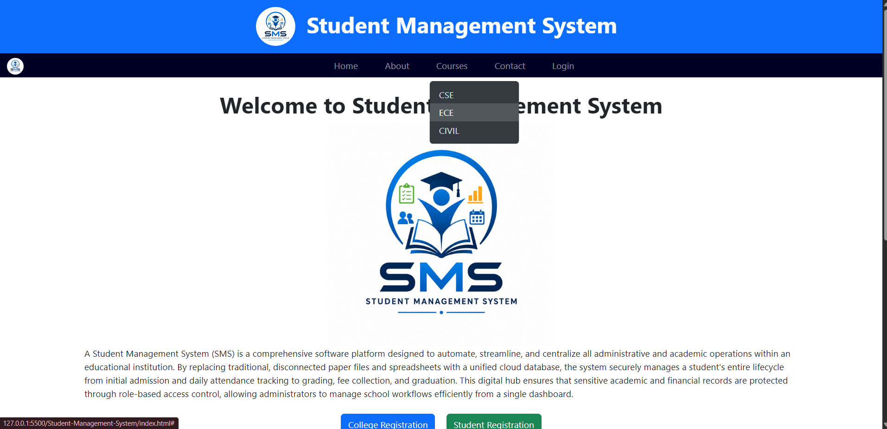
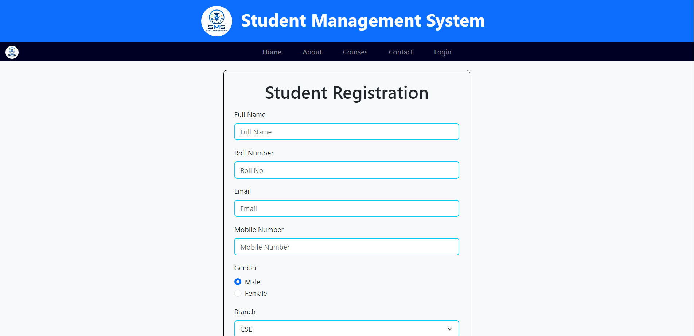
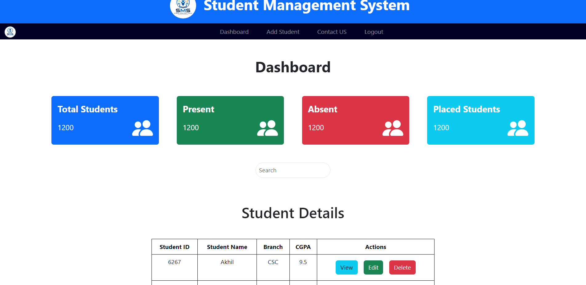
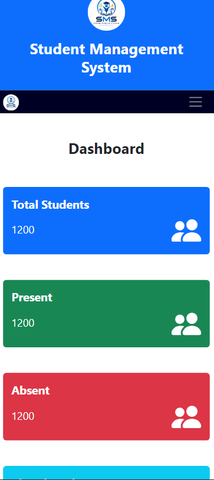

# Student Management System

A simple and responsive Student Management System built using **HTML**, **Bootstrap**, and basic frontend technologies. This project provides a user-friendly interface for managing student information, registrations, courses, and dashboard statistics.

## Technologies Used

- HTML5
- Bootstrap 5
- CSS3
- JavaScript

## Features

### Home Page
- Responsive navigation bar
- About section
- Course dropdown menu
- Contact page link
- Login page access
- Introduction to the Student Management System



---

### Student Registration
- Student registration form
- Full Name input
- Roll Number input
- Email input
- Mobile Number input
- Gender selection
- Branch selection
- Form validation support



---

### Dashboard
- Total Students statistics
- Present Students statistics
- Absent Students statistics
- Placed Students statistics
- Student search functionality
- Student details table
- View, Edit, and Delete actions



---
### Mobile-View

## Project Structure

```text
Student-Management-System/
│
├── index.html
├── login.html
├── register.html
├── dashboard.html
├── css/
│   └── style.css
├── js/
│   └── script.js
├── home-page.png
├── student-registration.png
├── dashboard.png
├── mobile-view.png
├── logo.png
└── README.md
